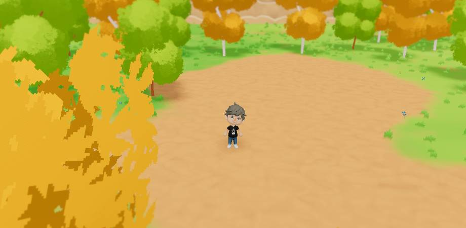
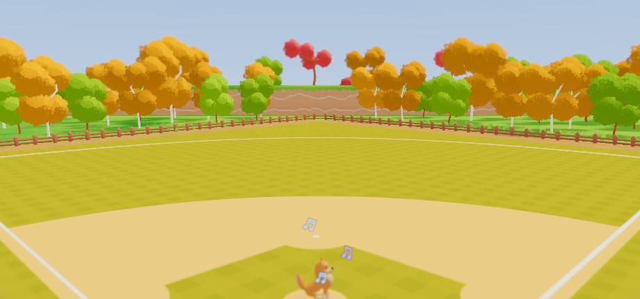
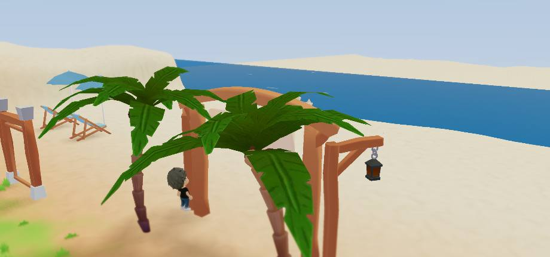
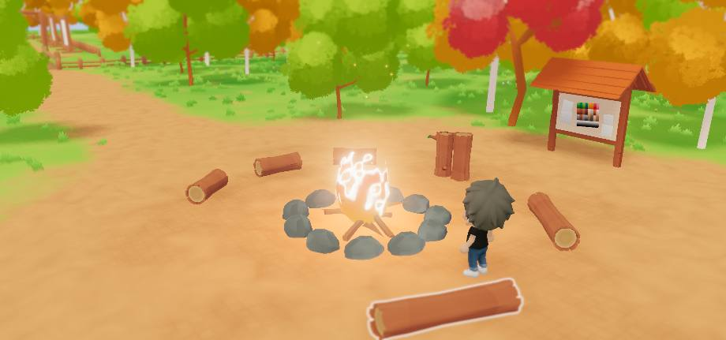
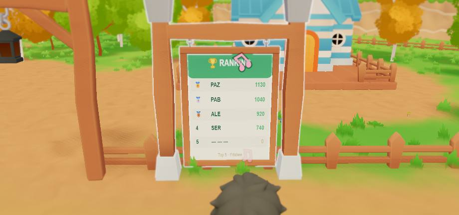

# Sergii's Portfolio — a portfolio you can walk around

A personal portfolio built as a small explorable world instead of a page: a
low-poly park you actually walk through, with a dog, two minigames, a live
leaderboard and a house you can go inside. It runs in the browser on **WebGPU**
— no game engine, no server-side rendering.

There is also a **Quick Overview** for anyone in a hurry: the same content as a
plain document, one click from the start screen.



---

## What's in there

### Frisbee with the dog

Aim, curve the throw around a balloon, then time a power bar. Ranked mode is ten
scored rounds; practice is unlimited throws. How close the dog catches it decides
the score — and the sound that plays.



### Beach volleyball

Keep the rally going without letting the ball hit the sand. Mid-rally the ball
swaps between a beach ball, a football and a coconut, and each is a different
weight in the wind.



### A world, not a backdrop

A day/night cycle, a stylised fire, ambience that rises as you approach the
river or the campfire, footprints in the sand, and benches you can sit on.



### A leaderboard that lives in the world

The Top 10 is painted onto a canvas texture and mapped onto a sign by the pitch,
so the board you read while walking past is the same data the results screen
shows.



Plus a world map with fast travel, a computer in the house holding the written
CV, a trophy shelf with the certificates, and a contact form.

The whole thing is **bilingual** — English by default, Spanish if that is what
your browser asks for, and a manual switch in the settings either way.

---

## Running it

```bash
cd my-portfolio
npm install
npm run dev      # https://localhost:5173
npm run build    # → dist/
```

The dev server is HTTPS on purpose: WebGPU and several device APIs need a secure
context. Your browser will warn once about the self-signed certificate.

> **WebGPU is required**, not optional. There is no WebGL fallback: the water,
> ground, grass and cloud shaders are written in TSL and are what the world is
> built around. Chrome/Edge 113+, Safari 18+, or Firefox 141+ on Windows.

---

## Built with

| | |
|---|---|
| [three.js](https://threejs.org/) `0.183` | rendering, on `WebGPURenderer` |
| TSL | the custom shaders — water, ground, grass, clouds — written in JavaScript rather than GLSL |
| [Rapier3D](https://rapier.rs/) `0.19` | character controller and collision |
| [Howler.js](https://howlerjs.com/) | music, ambient beds and one-shot SFX |
| [Firebase](https://firebase.google.com/) | the online leaderboard |
| [Vite](https://vitejs.dev/) `6` | dev server and build |
| [nipplejs](https://yoannmoi.net/nipplejs/) · [lil-gui](https://lil-gui.georgealways.com/) | touch joystick · debug panel |

---

## How it is put together

```
my-portfolio/
├── src/Experience/
│   ├── Experience.js     the singleton that owns everything below
│   ├── Camera.js  Renderer.js
│   ├── Utils/            Time · Sizes · Quality · Resources · i18n · AudioManager
│   └── World/
│       ├── World.js      orchestrates the scene
│       ├── scene/        the static park: floor, river, trees, fences, props
│       ├── TSL/          the shaders (water, ground, grass, clouds, noise)
│       ├── ui/           every DOM surface: modals, HUD, the Quick Overview
│       └── *.js          character, dog, minigames, interactions
├── static/               what ships: compressed models, textures, audio
├── audio-source/         audio masters (never shipped)
└── tools/                the asset pipelines
```

A few things worth knowing if you go digging:

**One update loop.** `Time` emits a tick and `Experience` walks camera → world →
renderer in that order. Nothing schedules its own `requestAnimationFrame`.

**Quality adapts at runtime.** `Utils/Quality.js` scales shadow resolution, grass
density, canvas resolution and effects from measured FPS, and objects read the
setting live rather than at construction.

**Assets are compressed by scripts, not by hand.** Draco for meshes, KTX2/UASTC
for textures, Opus + AAC for audio. Masters live outside `static/` so they never
ship.

```bash
node tools/compress-glbs.mjs
node tools/convert-ktx2.mjs
node tools/transcode-sfx.mjs
```

**Two audio formats, one download.** Every sound exists as Opus (`.webm`) and AAC
(`.m4a`) because no single format is safe across browsers. Howler picks the first
the browser reports it can play, so only one is ever fetched.

**Text lives in catalogs, not in components.** `src/locales/*.js`, under an
`overview.*` branch for the document page and `game.*` for the world. Spanish is
the source language and English is a layer of overrides on top, so no sentence is
written twice.

---

## Credits

The low-poly models are partly hand-made in Blender and partly the work of
[Isa Lousberg](https://isalousberg.com/). The soundtrack is generated with Suno.
The whole thing owes a great deal to [Bruno Simon](https://bruno-simon.com/) and
[Three.js Journey](https://threejs-journey.com/), where I learned most of what
makes it run.

Built by **Sergii Butrii** — [sergiibutrii5@gmail.com](mailto:sergiibutrii5@gmail.com)
